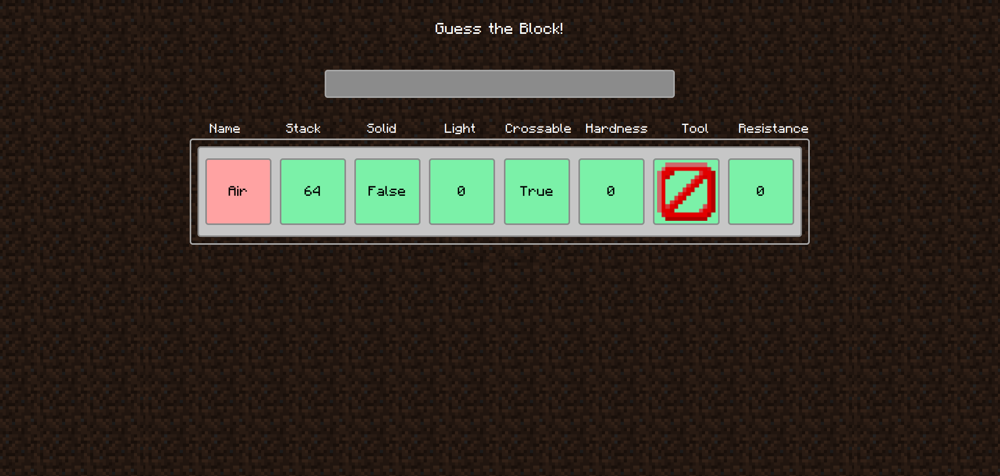

# MC-GuessTheBlock
# Jonay Contreras Rodríguez, Rubén Abreu González

## Guess the Block!


## Index
- [MC-GuessTheBlock](#mc-guesstheblock)
- [Jonay Contreras Rodríguez, Rubén Abreu González](#jonay-contreras-rodríguez-rubén-abreu-gonzález)
  - [Guess the Block!](#guess-the-block)
  - [Index](#index)
    - [Description](#description)
    - [How to use](#how-to-use)
      - [Open Json Server](#open-json-server)
      - [Running the app](#running-the-app)
    - [VueDocGen documentation](#vuedocgen-documentation)

### Description
*MC Guess The Block* is a game about guessing the minecraft block by some of its attributes.

- search the block you want to guess.
  
- compare the attributes:
  - Red means wrong
  - Green means right

### How to use
#### Open Json Server
> ./jsonServer.sh 

<details open>
<summary>Result</summary>

```bash
  \{^_^}/ hi!

  Loading ./FakeApi.json
  Done

  Resources
  http://localhost:3000/blocks
  http://localhost:3000/items
```
</details>

#### Running the app
> [!IMPORTANT]
> cd guessTheBlock

- **Web**
> npm run serve

- **Linux**
> npm run electron:build
>
> ./dist_electron/guess-the-block-0.1.0.AppImage

- **Windows**
> npm run electron:build -- --windows

### VueDocGen documentation
- [GameView](guessTheBlock/docs/components/views/GameView.md)
- [GuessView](guessTheBlock/docs/components/views/GuessView.md)
- [SelectBlockView](guessTheBlock/docs/components/views/SelectBlockView.md)